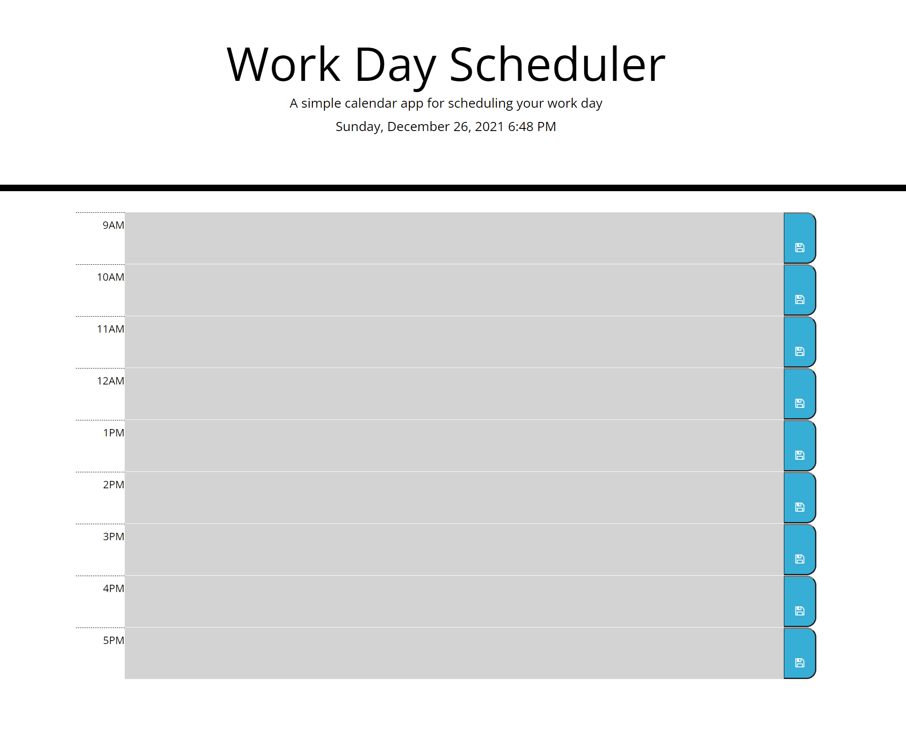

# work-day-planner

## Purpose

This application has been designed to organise tasks in hourly time blocks.
The Tasks can be saved and rewitten to the time blocks from local storage using the save button.
The time blocks change colour based on if they are in the present past or future.
These functionalities are all essential to create an organized scheduled workday.

## Build With

- HTML
- CSS
- Javascript
- Jquery

## Webpage

The running application can be accessed here for viewing and testing:

https://jacobgit3.github.io/work-day-planner/

The code for this application can be found in this github repository:
https://github.com/JacobGit3/work-day-planner

This is a screenshot of the Webpage 
*note time blocks are greyed out due to being in the past*

## Contribution

Code written by Jacob Liberty

Initial Code/CSS from Trilogy Education
